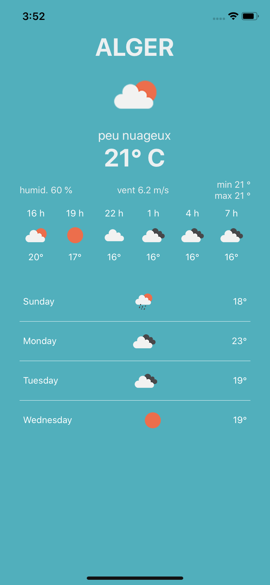
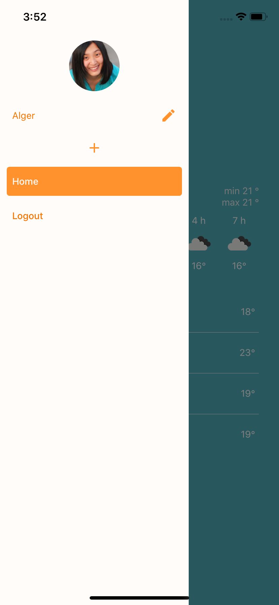
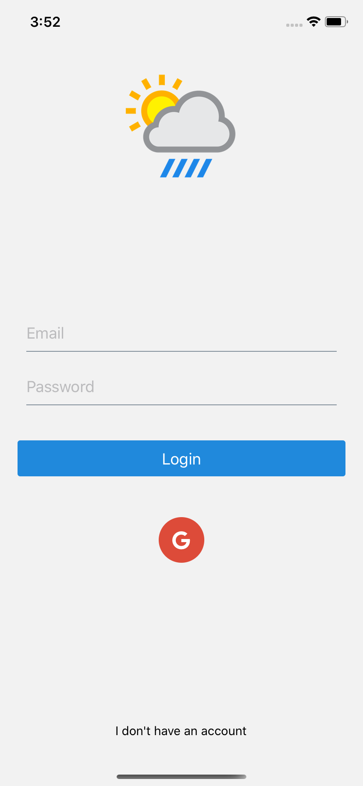

# Weather APP

    
    
    

This is a [React Native](https://facebook.github.io/react-native/) app that i created to grasp the different libraries, it's based on [React Native boilerplate](https://github.com/thecodingmachine/react-native-boilerplate).

It has a Firebase auth both with email/pwd and Google Auth, it uses Redux to store data and Redux Saga to grab data online from [OpenWeatherMap](https://openweathermap.org), a Custom Drawer with react navigation.

# the libraries used in this project are : 
- React Native
- Redux
- Redux Saga
- Firebase
- React navigation
- React Native Elements